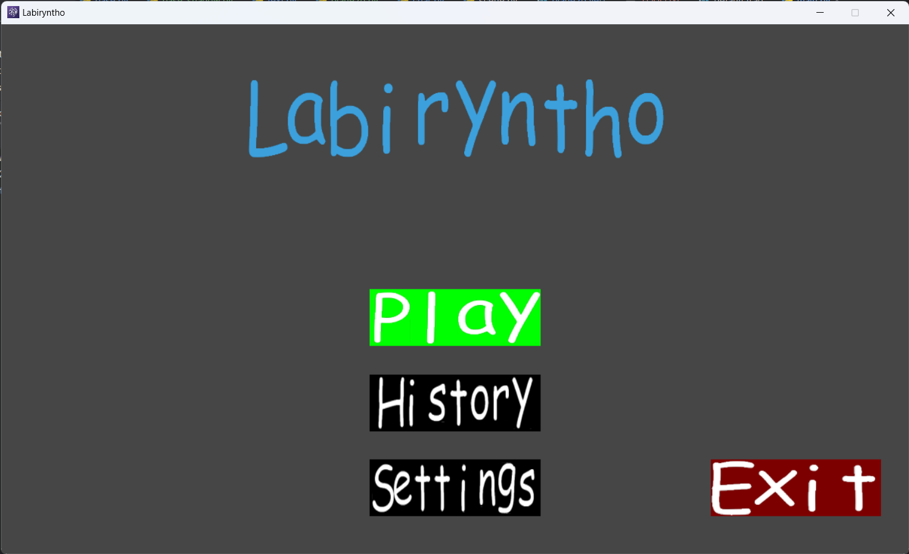
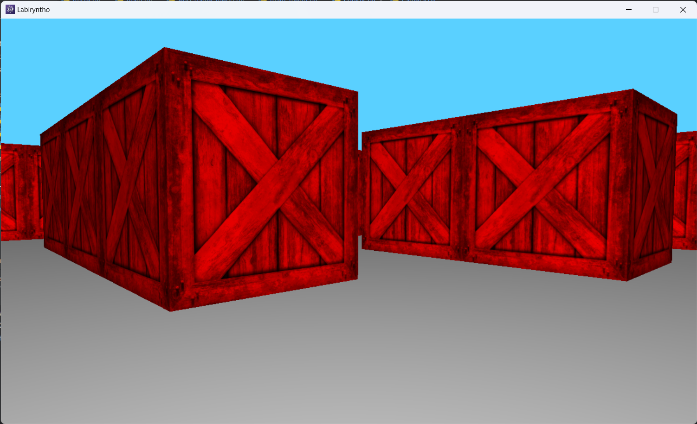
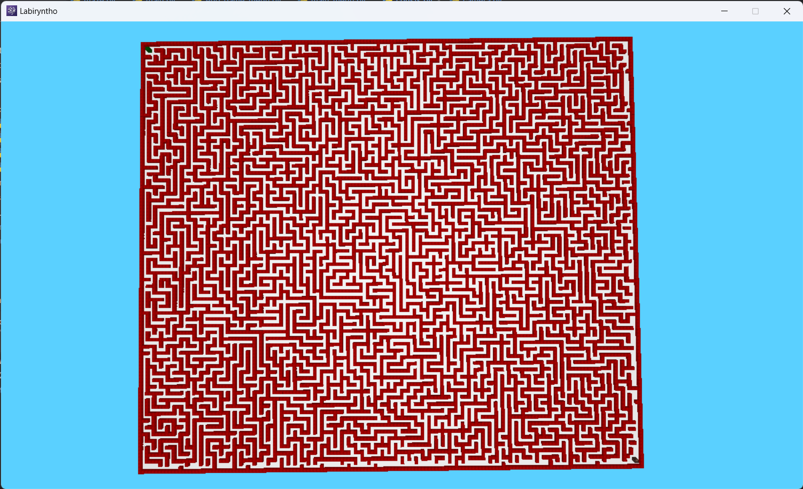

# FusionFlare

A simple game engine written in Python for fast prototyping.

> [!WARNING]\ 
> This project is currently in development. 
> Breaking changes may occur and performance may be suboptimal.

## Example game - labiryntho:

### Photos:





### Run the game:

- #### Install packages:

  ```bash
  pip install -r requirements.txt
  ```

- #### Run:

  Windows:
  ```bash
  python examples.labiryntho.src.main
  ```

  Linux:
  ```bash
  python3 examples.labiryntho.src.main
  ```

### Cheat codes

- `F1` - Shift camera types
- `F2` - Always update the camera (gives 2x speed boost when camera is updated in other scenes)
- `F3` - Show debug information
